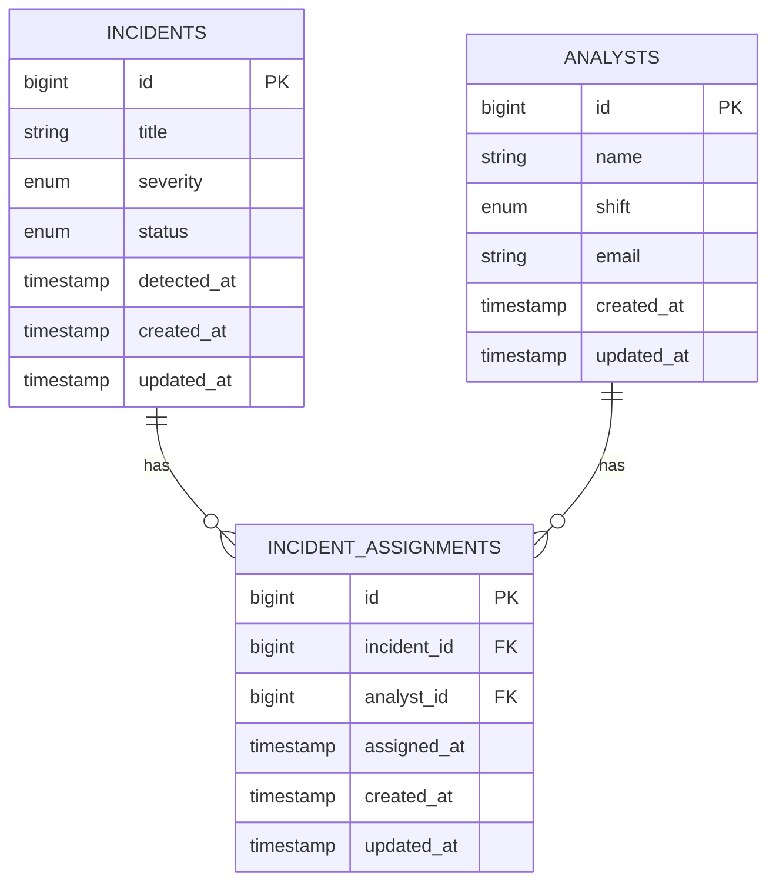

<div align="center">
  
</div>

<div align="center">


</div>

## Overview

Security Incident Log API adalah API sederhana berbasis Laravel untuk simulasi workflow SOC Analyst.
Project ini menampilkan pengelolaan data insiden keamanan dan assignment analis dengan relasi antar tabel.

## Key Features

- Incident management (`incidents`) dengan level severity dan status.
- Analyst directory (`analysts`) dengan informasi shift.
- Many-to-many assignment (`incident_assignments`) untuk memetakan analyst ke incident.
- REST endpoint JSON untuk list dan detail incident beserta relasinya.
- Seed data siap demo untuk kebutuhan presentasi/tugas.

## Database Schema

Project ini memakai 3 tabel utama yang saling terhubung.

### 1. `incidents`

Menyimpan data insiden keamanan.

| Column          | Type      | Description                                         |
| --------------- | --------- | --------------------------------------------------- |
| `id`          | bigint    | Primary key                                         |
| `title`       | string    | Judul insiden                                       |
| `severity`    | enum      | `low`, `medium`, `high`, `critical`         |
| `status`      | enum      | `open`, `in_progress`, `resolved`, `closed` |
| `detected_at` | timestamp | Waktu insiden terdeteksi                            |
| `created_at`  | timestamp | Waktu data dibuat                                   |
| `updated_at`  | timestamp | Waktu data terakhir diubah                          |

### 2. `analysts`

Menyimpan data analyst / SOC analyst.

| Column         | Type      | Description                           |
| -------------- | --------- | ------------------------------------- |
| `id`         | bigint    | Primary key                           |
| `name`       | string    | Nama analyst                          |
| `shift`      | enum      | `morning`, `afternoon`, `night` |
| `email`      | string    | Email unik analyst                    |
| `created_at` | timestamp | Waktu data dibuat                     |
| `updated_at` | timestamp | Waktu data terakhir diubah            |

### 3. `incident_assignments`

Tabel penghubung antara `incidents` dan `analysts`.

| Column          | Type        | Description                  |
| --------------- | ----------- | ---------------------------- |
| `id`          | bigint      | Primary key                  |
| `incident_id` | foreign key | Mengarah ke `incidents.id` |
| `analyst_id`  | foreign key | Mengarah ke `analysts.id`  |
| `assigned_at` | timestamp   | Waktu assignment dibuat      |
| `created_at`  | timestamp   | Waktu data dibuat            |
| `updated_at`  | timestamp   | Waktu data terakhir diubah   |

### Relasi Antar Tabel

- Satu `incident` bisa punya banyak `analyst`.
- Satu `analyst` bisa menangani banyak `incident`.
- Relasi many-to-many ini disimpan di tabel `incident_assignments`.
- Jika `incident` atau `analyst` dihapus, data assignment ikut terhapus (`cascade on delete`).
- Kombinasi `incident_id + analyst_id` harus unik, jadi satu analyst tidak bisa di-assign dua kali ke incident yang sama.

## Entity Relationship Diagram



## Relasi Sederhana

```text
incidents (1) -----< incident_assignments >----- (1) analysts
                 many-to-many bridge table
```

## API Endpoints

| Method | Endpoint                   | Description                                       |
| ------ | -------------------------- | ------------------------------------------------- |
| GET    | `/api/v1/incidents`      | Get all incidents with assigned analysts          |
| GET    | `/api/v1/incidents/{id}` | Get single incident detail with assigned analysts |

## Sample Response

```json
{
  "success": true,
  "message": "List incidents with assigned analysts",
  "data": [
    {
      "id": 2,
      "title": "Malicious PowerShell execution detected",
      "severity": "critical",
      "status": "open",
      "analysts": [
        {
          "id": 1,
          "name": "Rina Pratama",
          "shift": "morning",
          "email": "rina.soc@example.com"
        }
      ]
    }
  ]
}
```

## Quick Start

```bash
composer install
cp .env.example .env
php artisan key:generate
php artisan migrate:fresh --seed
php artisan serve
```

Open:

- `http://127.0.0.1:8000/api/v1/incidents`
- `http://127.0.0.1:8000/api/v1/incidents/1`

## Project Structure

```text
app/
  Http/Controllers/Api/IncidentController.php
  Models/Analyst.php
  Models/Incident.php
  Models/IncidentAssignment.php
database/
  migrations/
  seeders/IncidentSecuritySeeder.php
routes/
  api.php
```

## Academic Mapping (PBW)

- Definisi API: tersedia dalam dokumentasi dan implementasi endpoint JSON.
- Tujuan/Pemanfaatan API: backend service untuk pertukaran data incident-analyst.
- Pentingnya API: mendukung integrasi, otomasi, dan monitoring pada use case cybersecurity.
- Program sederhana + relasi tabel: terealisasi via `incidents`, `analysts`, dan `incident_assignments`.

## Tech Stack

- Laravel 13
- PHP 8.5
- SQLite (default local database)

## Author

**Mocha Rezky**

---
